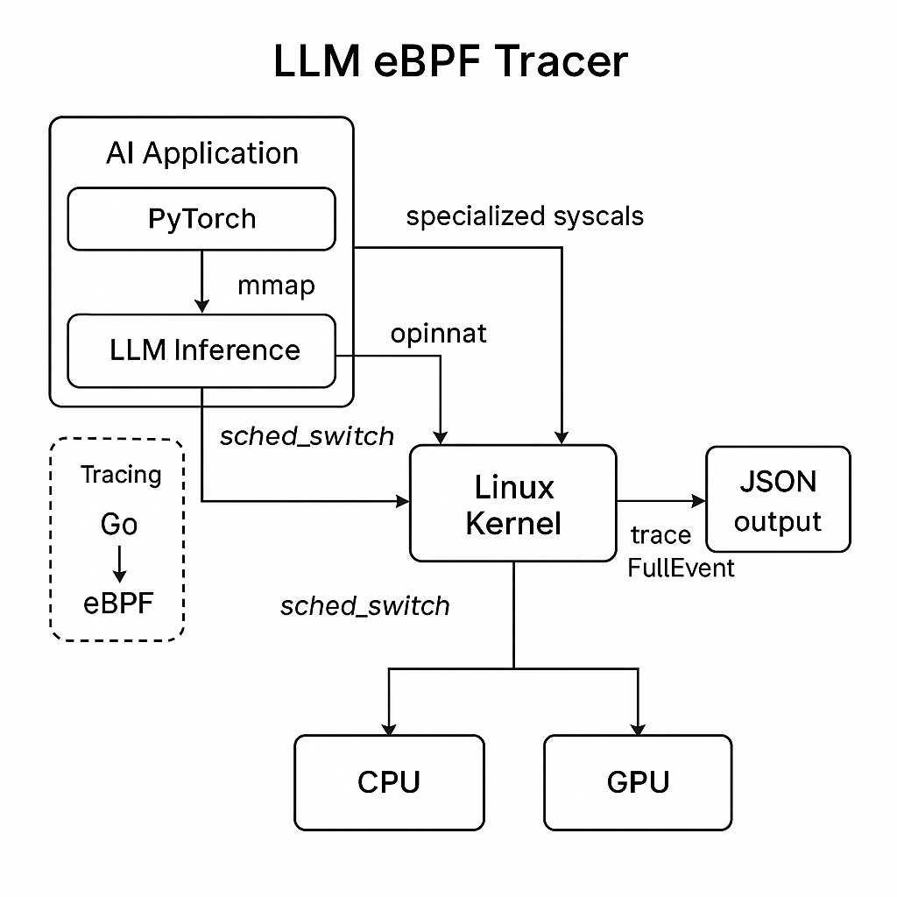

# 🔍 LLM eBPF Tracer

**Trace and analyze Large Language Model (LLM) inference workloads (e.g., PyTorch + CUDA) at the Linux kernel level using eBPF.**

This project enables system-level observability for modern AI inference pipelines — revealing what happens when LLMs interact with memory, CPUs, GPUs, and the filesystem under the hood.

---

## 🧠 Why This Project?

LLMs like LLaMA, Mistral, and GPT-variants require optimized infrastructure. While most focus on model design or training, inference performance depends heavily on OS-level behaviors like:

- File I/O for model weights (multi-GB mmap)
- CPU-GPU data paths and device access
- Thread pinning, scheduling, and NUMA locality
- Page locking (mlock) and memory pressure

Traditional profilers miss this. **eBPF (extended Berkeley Packet Filter)** allows us to trace these interactions with zero modification to the model code or OS kernel.

---

## 📦 Features

- ✅ Trace `mmap`, `mlock`, `openat` during model loading
- ✅ Visualize `sched_switch` to track inference thread behavior
- ✅ Monitor access to `/dev/nvidia*` (GPU devices)
- ✅ Support for PyTorch, TensorRT, and Hugging Face model servers
- ✅ Plug-and-play tracing using `bpftrace` and `bcc`
- 🧪 Optional integration with Prometheus and Grafana dashboards

---

## 🖼️ Architecture Overview



---

## ⚙️ Example Tracing Scripts

### 🧩 Track `mmap` Usage (Model Weights Loading)

```bash
bpftrace -e 'tracepoint:syscalls:sys_enter_mmap { @[comm] = count(); }'
```

### 🔒 Monitor Memory Locking (PyTorch’s `mlock` Calls)

```bash
bpftrace -e 'tracepoint:syscalls:sys_enter_mlock { @[comm] = count(); }'
```

### 🔁 Visualize Scheduler Switches (CPU Thread Behavior)

```bash
bpftrace -e 'tracepoint:sched:sched_switch { @[prev_comm, next_comm] = count(); }'
```

### 🎮 Watch GPU Access (Device File Usage)

```bash
bpftrace -e 'tracepoint:syscalls:sys_enter_openat /str(args->filename) =~ "/dev/nvidia.*/" / { @[comm] = count(); }'
```
---

## 📊 Planned Dashboard (Work in Progress)

- 🔹 Model load phase duration
- 🔹 `mmap` vs `mlock` event frequency
- 🔹 CPU usage per inference worker
- 🔹 NUMA locality and scheduling efficiency
- 🔹 Live latency trends per token

---

## 📁 Repo Layout

```bash
.
├── scripts/               # bpftrace tracing scripts
│   ├── mmap.bt
│   ├── mlock.bt
│   ├── sched.bt
│   └── gpu_access.bt
├── dashboards/            # (WIP) Grafana dashboards for LLM workload visibility
├── benchmark/             # Scripts to benchmark LLM inference performance
├── README.md              # This file
└── LICENSE
```
---
## 💡 Use Cases

- Debug slow inference cold starts due to poor I/O or mmap
- Optimize thread pinning and scheduling latency
- Monitor GPU usage contention in shared environments
- Profile PyTorch and TensorRT workloads at system level
- Tune NUMA policies for large model inference

---

## 🚀 Getting Started

### ✅ Prerequisites

- Linux kernel ≥ 5.8
- `clang`, `llc`, and `bpftool` installed
- Go ≥ 1.20
- Root/sudo access (required to load eBPF programs)

```bash
sudo apt update
sudo apt install \
  linux-headers-$(uname -r) \
  build-essential \
  clang llvm libelf-dev libbpf-dev
```
---

### 🔧 Build Instructions

#### 1. **Clone the Repo**

```bash
git clone https://github.com/ravikumar1907/llm-ebpf-tracer
cd llm-ebpf-tracer
```

#### 2. **Build the eBPF C Programs**

```bash
make bpf
```

This should generate `.o` object files from the `bpf/*.bpf.c` sources.

---

#### 3. **Run the Go Tracer**

```bash
sudo go run ./cmd/main.go
```

You should see log output like:

```
Listening for mmap events... Press Ctrl+C to stop.
Received mmap trace event, raw bytes: [120 156 ...]
```

---

### 🧪 Simulate an mmap Syscall

Open another terminal and run:

```bash
python3 -c "import torch; torch.zeros((10000, 10000)).cuda()"
```

This will trigger `mmap` and possibly `mlock` + `/dev/nvidia*` accesses.

You should see trace output from the eBPF tracer as those syscalls happen.

---

### 📈 View Metrics (Optional)

If you enabled the Prometheus exporter:

```bash
curl http://localhost:2112/metrics
```

---

## 🙋‍♂️ Contributions Welcome

We're looking for collaborators who are into:

- PyTorch, HuggingFace, or vLLM internals
- Kernel memory and NUMA optimization
- eBPF, tracing, and observability pipelines

Open an issue, drop a PR, or just DM me on LinkedIn!

---

## 📬 Author

**Ravikumar Vallabhu**  
Linux Kernel + AI Infra Enthusiast  
[LinkedIn →](https://www.linkedin.com/in/ravikumar-vallabhu-62b7518/)  
[GitHub →](https://github.com/ravikumar1907/llm-ebpf-tracer)

---

## 📘 License

MIT License — Free to use, modify, and share.

---