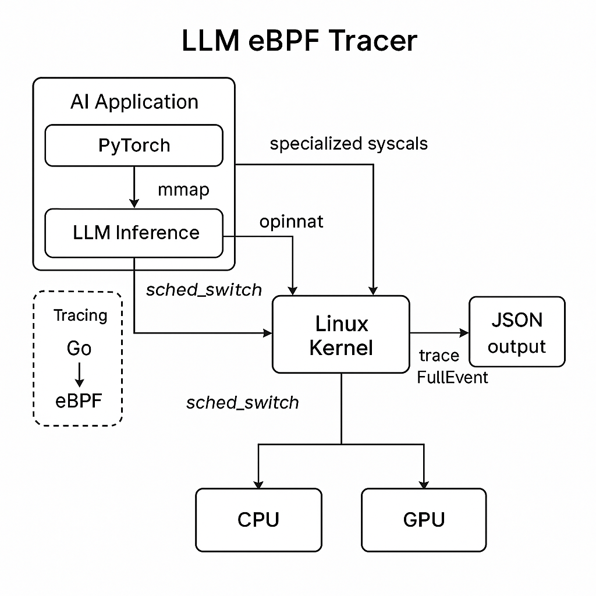

# High-Level Design (HLD): LLM eBPF Tracer

## 🧠 Overview

The LLM eBPF Tracer observes system-level behavior during large language model (LLM) inference workloads, primarily those executed via PyTorch or CUDA. It uses eBPF tracepoints to monitor syscalls like `mmap`, `mlock`, and GPU device access, providing visibility into kernel-level interactions.

## 🏗 Architecture Components

- **LLM Application Layer**: Python/C++-based inference pipeline (e.g., PyTorch, HuggingFace, vLLM)
- **eBPF Programs**: Attached to Linux tracepoints to collect syscall and scheduler events
- **Go Agent**: Loads and attaches eBPF programs, listens for perf/ringbuffer events, logs output
- **Export Layer (Optional)**: Prometheus/Grafana for visual insights

## 🔄 Data Flow

1. LLM triggers system calls (e.g., `mmap()` to load model).
2. eBPF probe attached to tracepoint intercepts syscall.
3. Kernel sends event to perf ring buffer.
4. Go program reads and serializes event.
5. Events are exported via JSON, Prometheus, or CLI.

## 🎯 Key Goals

- Trace memory usage patterns (mmap/mlock)
- Visualize GPU interaction (`/dev/nvidia*`)
- Capture CPU scheduling behavior (sched_switch)
- Build infra observability for LLM inference